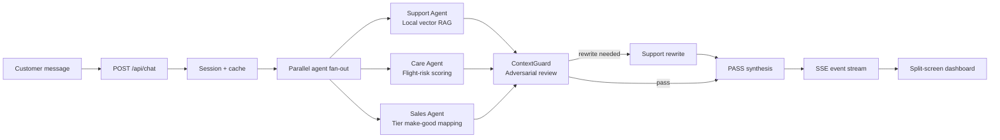

# Architecture

Project Panopticon is a Next.js application with a TypeScript orchestration layer. The app is intentionally local-first so demos do not depend on hosted services, while still exposing clean FlowZint and Redis integration points.

## Agent DAG

1. `/api/chat` validates the `UserPayload`.
2. The router checks the in-memory adjudication cache.
3. Support, Care, and Sales run concurrently with `Promise.all`.
4. Drafts are streamed to the Live War Room terminal.
5. ContextGuard evaluates source grounding, SLA limits, and tone.
6. Unsafe drafts are rewritten before synthesis.
7. The final response is streamed to the client pane.

## Local Vector Database

`data/synthetic_kb.md` is parsed into sections, tokenized, and indexed by `scripts/build-vector-index.ts`. The generated `data/vector-index.json` stores document term frequencies and inverse document frequencies. Runtime search uses cosine similarity with a tag boost.

This keeps RAG transparent for judges: every answer can be traced to local documentation.

## State And Cache

The current build uses an in-memory session store and cache for reliable local demos. The cache is keyed by normalized user ID, tier, message, and history. `.env.example` documents the optional Redis URL for a hosted persistence layer.

## FlowZint Integration Point

`lib/flowzint.ts` implements an OpenAI-compatible completion wrapper behind `FLOWZINT_API_KEY` and `FLOWZINT_BASE_URL`. The deterministic local agents are the default runtime, which makes the hackathon demo reproducible. Provider-backed prompt calls can be introduced agent-by-agent without changing the API contract or UI.

## API Surface

- `POST /api/chat`: streams war-room events as Server-Sent Events.
- `GET /api/openapi`: returns OpenAPI 3.1 JSON for the chat endpoint.

## Evaluation Alignment

- Innovation: adversarial multi-agent debate rather than a one-shot chatbot.
- Technical architecture: DAG execution, local RAG, SSE streaming, cache, strict schemas.
- Support: grounded technical fixes and hallucination removal.
- Care: real-time churn scoring and SLA credit guardrails.
- Sales: contextual make-good upgrade logic with distress suppression.
- Documentation: README, architecture, prompts, OpenAPI, demo script, LaTeX submission.
